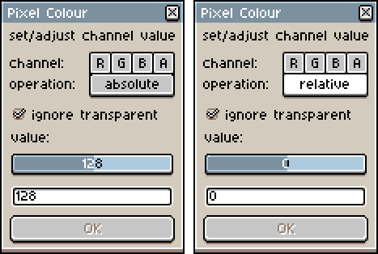

# aseprite-scripts

This repo contains custom scripts for use in Aseprite.

# Installation

Copy the contents of the `scripts` folder to your Aseprite scripts folder.  
[How to locate the Aseprite scripts folder?](https://community.aseprite.org/t/locate-user-scripts-folder/2170)

# Scripts

This section contains a description of the scripts.  More details can be found in comment blocks at the top of the script files.

## Colour selected pixels

Provides a dialog for the user to set/adjust the RGBA colour channels of selected pixels on an image.
* Allows single or multiple selections for modification.
* Pixels with no alpha value (transparent) can be opted in or out of the change (defaults to out).
* The value can be modified with a slider or a numeric text box.
* The dialog remembers and restores the values when toggling between absolute and relative modes.
* The result of the operation are previewed live on the image and can be cancelled.
* The accepted results are undoable/redoable.  Undo history contains a single event for the operation..
* The RGBA and operation buttons on the dialog have tooltips that explain the state of the dialog when hovering.

  
